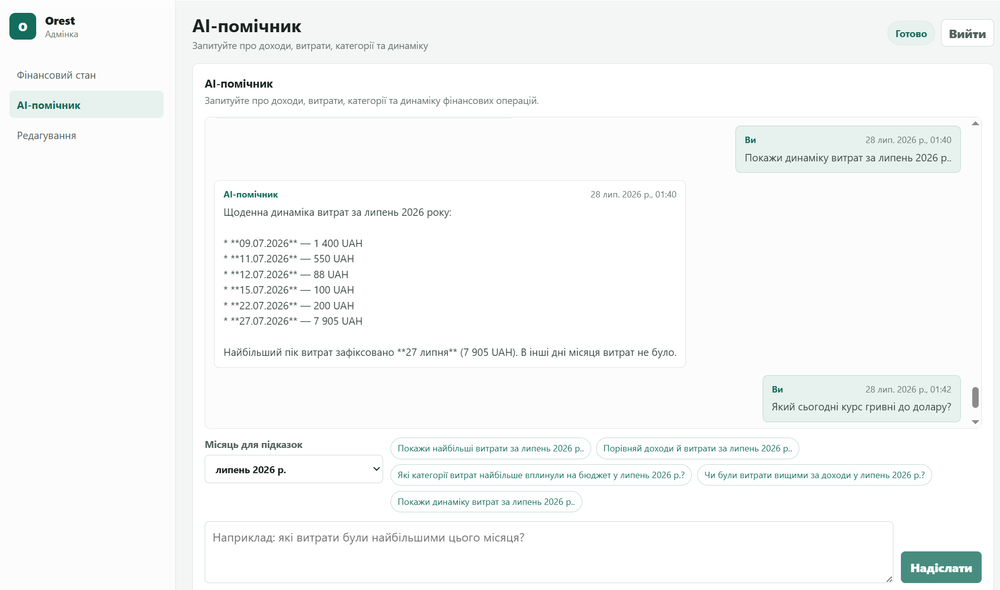
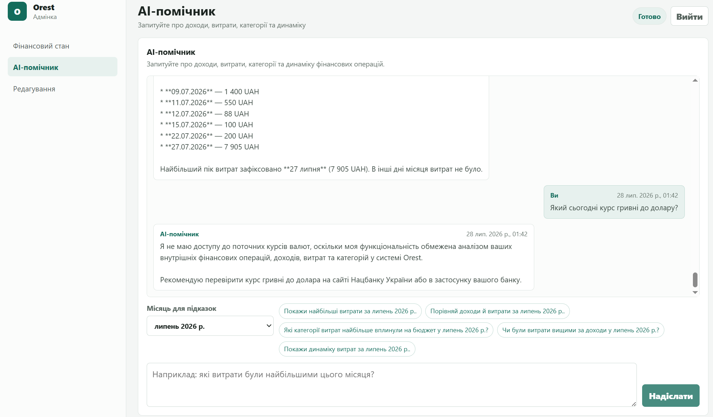
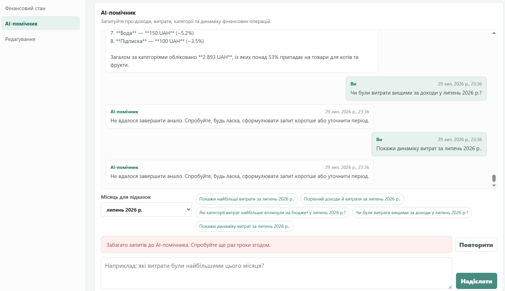

# Результати перевірки AI-помічника

Дата повторної перевірки: 29 липня 2026 року.

Документ фіксує результати сценаріїв із п. 9
[`ai_chat_prompt.md`](ai_chat_prompt.md), а також перевірку секретів. Жодні
значення з `.env`, cookie, ключі Gemini, URL бази даних або фінансові дані в
цей документ не додавалися.

## Підсумок

| Перевірка | Результат |
| --- | --- |
| Backend unit-тести AI-чату | Пройдено: 15 з 15 |
| Production-збірка React | Пройдено |
| Перевірка секретів | Пройдено: `Secrets found: 0` |
| Повне покриття п. 9 | Часткове: див. статуси нижче |

## Візуальне підтвердження

### Фінансовий запит: денна динаміка витрат

AI-помічник використовує фінансові дані системи та повертає відповідь для
запитаного періоду.



### Позатематичний запит: коректне обмеження функціональності

AI-помічник не імітує доступ до актуального курсу валют і пояснює межі своєї
функціональності.



### Перевищення частоти запитів: зрозуміле повідомлення

Після перевищення ліміту 10 звернень за 60 секунд інтерфейс показує безпечне
повідомлення про надмірну кількість запитів і пропонує повторити останній
запит пізніше.



## Виконані автоматичні перевірки

```powershell
.\.venv\Scripts\python.exe -m unittest discover -s tests -p "test_ai_chat_*.py" -v
```

Результат: `Ran 15 tests ... OK`.

Набір перевіряє:

- реєстрацію трьох захищених API-маршрутів чату;
- нормалізацію та обмеження повідомлення користувача;
- валідацію дат і періодів до звернення до БД;
- read-only реєстр дозволених фінансових tools;
- мінімальні агреговані результати tools без сирих операцій;
- парсинг відповіді Gemini та вилучення несумісного з Gemini поля
  `additionalProperties` зі схеми;
- один автоматичний повтор LangGraph після короткочасної помилки PostgreSQL.
- rate limit: 10 запитів за 60 секунд, `429` для 11-го запиту, поновлення
  доступу після завершення рухомого часового вікна й незалежні ліміти для різних
  admin.

```powershell
npm.cmd run build
```

Результат: production-збірка Vite успішна.

```powershell
powershell -ExecutionPolicy Bypass -File .\scripts\scan-secrets.ps1
```

Результат: `Secrets found: 0`. Режим `Bypass` застосовано лише до одного
запуску скрипта; системну execution policy не змінено.

Додаткові ізольовані перевірки в контейнері API:

- позатематичний запит до Gemini повернув текст без виклику фінансового tool;
- `GET /api/ai/conversations/last` без cookie повернув `401`.

## Сценарії з п. 9

| № | Сценарій | Статус | Підтвердження / примітка |
| --- | --- | --- | --- |
| 1 | Перше повідомлення створює діалог і повертає його ID | Пройдено вручну | Під час перевірки UI створено діалог і отримано відповідь AI. |
| 2 | Продовження за тим самим ID та відновлення історії | Пройдено вручну | Історія останнього діалогу завантажувалася після оновлення сторінки. |
| 3 | Фінансовий запит викликає коректний tool і повертає українську відповідь | Пройдено вручну + unit-тести | Запити з підказок у UI працювали; unit-тести підтверджують замкнений read-only реєстр та агрегований формат даних. Вибір tool самою генеративною моделлю не є детермінованим, тому одиничний прямий виклик Gemini не використовується як тестовий критерій. |
| 4 | Позатематичний запит не викликає tool | Пройдено | Ізольований виклик Gemini: текстова відповідь, tool-виклики відсутні. |
| 5 | Порожні дані дають коректне повідомлення без вигаданих сум | Потребує окремої ручної перевірки | Автоматичний тест порожнього набору даних із повним циклом Gemini → tool → Gemini ще не створено. |
| 6 | Невалідні дати, типи та ліміти не створюють SQL-помилки | Пройдено | Unit-тести перевіряють невалідний період, перетин періодів і Pydantic-валідацію до доступу до БД. |
| 7 | Помилки Gemini, tool та БД повертають безпечний результат | Частково пройдено | Є безпечна відповідь для помилки Gemini в коді та unit-тест автоматичного повтору після помилки PostgreSQL. Повний інтеграційний тест штучної помилки Gemini/tool ще не створено. |
| 8 | Неавторизований запит — `401`, чужий діалог — `404` | Частково пройдено | `401` перевірено ізольовано. Перевірка `404` потребує другого користувача React-адмінки, якого в поточній версії немає. Власність діалогу перевіряється endpoint-ом у коді. |
| 9 | Обмеження довжини, частоти, історії та циклів tools | Пройдено | Повідомлення обмежено 2000 символами, історія — 50 повідомленнями, цикл — 4 tool-кроками. Rate limit дозволяє до 10 запитів за 60 секунд для кожного admin; 11-й запит отримує `429` і `Retry-After`. Це підтверджено трьома unit-тестами та ручною перевіркою в UI. |
| 10 | Логи та відповіді не містять секретів і надлишкових даних | Пройдено для репозиторію | Проєктний сканер не знайшов секретів. Додатково tools повертають лише агрегати; секрети не записувалися до цього документа. |

## Невиконаний рекомендований крок

1. Додати інтеграційні тести для порожніх даних, помилок Gemini/tool і сценарію
   `404` для чужого `conversation_id` після появи багатокористувацької
   авторизації або ізольованих тестових користувачів.
