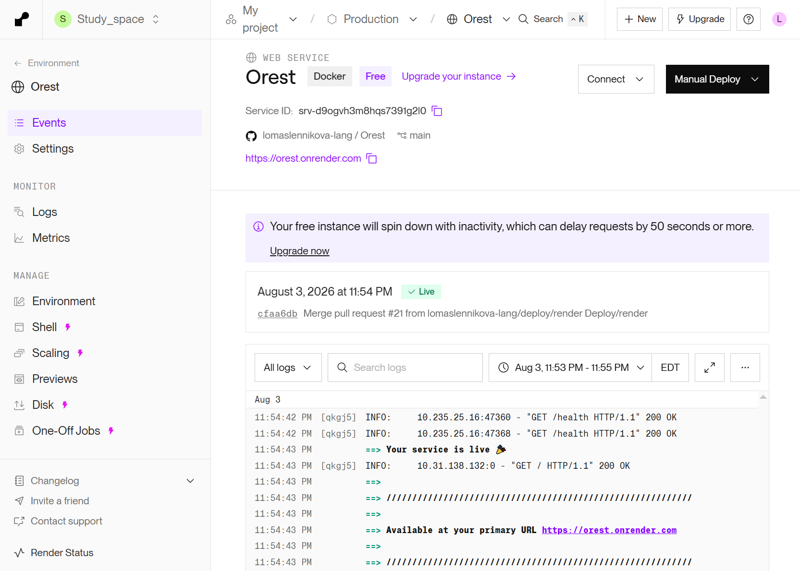
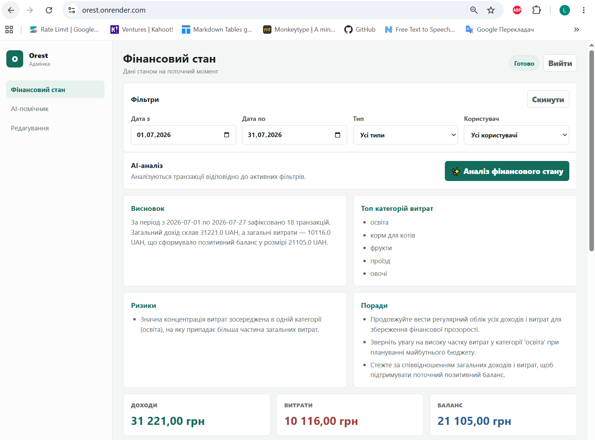
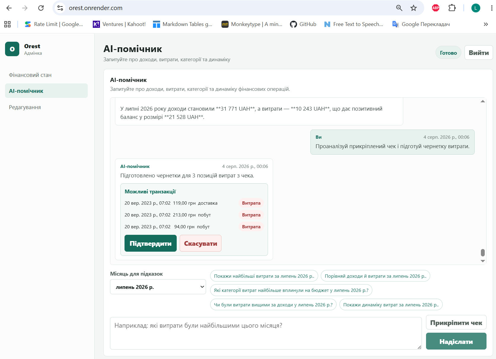
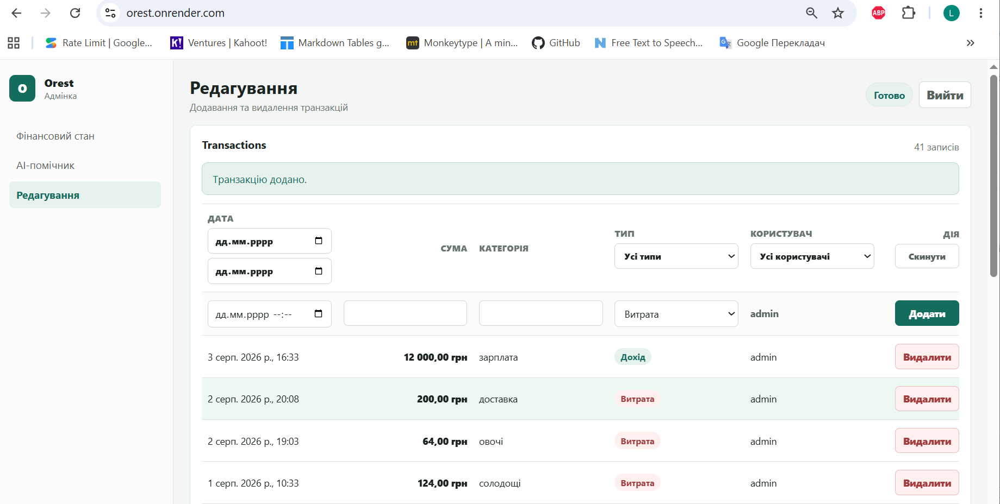
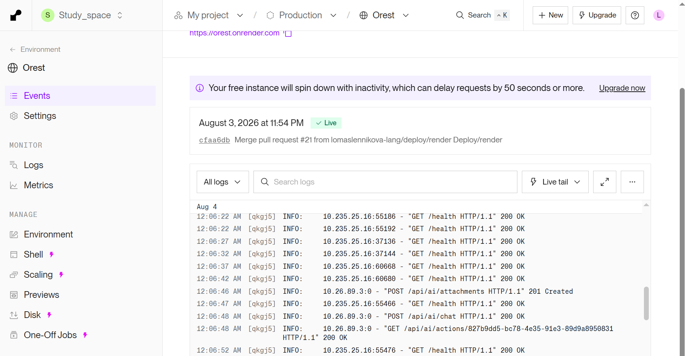

# DEPLOY — нотатки перевірки

> Період перевірки: 3–4 серпня 2026 року. Середовище: Render Free Web Service, Docker, FastAPI + React, Neon PostgreSQL.

## Підсумок

Застосунок **Orest** успішно розгорнуто як Render Web Service. Сервіс має публічний HTTPS URL, запускається з `Dockerfile.render` та обслуговує React SPA і FastAPI API в одному контейнері. Перевірки підтвердили доступність застосунку, health endpoint, взаємодію з Neon та роботу основних AI-сценаріїв.

## Пов'язані документи

- [Погоджений план розгортання у Render](../ai/ai_prompt_deploy.md) — архітектура, відповідальність виконавців і послідовність кроків Lesson 13.
- [Інструкція з деплою](../deploy.md) — налаштування Render, змінні середовища, команди, health endpoint та типові помилки.

## Результати перевірки п.5.11

| Перевірка | Результат |
| --- | --- |
| `git status` | Перевірено стан робочого дерева; до фінального коміту Lesson 13 залишалися лише очікувані документаційні матеріали. |
| `git diff` | Переглянуто зміни конфігурації деплою, обробки тимчасових помилок Gemini та документації. |
| `git diff --check` | Успішно: помилок пробілів і маркерів конфлікту не виявлено. |
| Python-тести | Успішно: `31 tests, OK`. |
| Збірка frontend | Успішно: `npm.cmd run build`. |
| Перевірка секретів | Успішно: `Secrets found: 0`; фактичні значення змінних середовища не додано до Git. |
| Docker image | Успішно зібрано з `Dockerfile.render`; у контейнер включено frontend build і шаблони AI. |
| `GET /health` | `200 OK`; endpoint виконує перевірку з'єднання з базою даних Neon. |
| `GET /` | `200 OK`; React SPA доступний за публічним URL. |
| `GET /openapi.json` | `200 OK`; FastAPI OpenAPI-схема доступна. |
| `GET /api/me` без сесії | Очікувано `401 Unauthorized`; захищений API не відкритий анонімному користувачу. |

## Підтвердження в Render і застосунку

### DEPLOY_0 — успішний live-деплой і health checks

Render показує статус live для Web Service. У журналах є повторювані успішні запити `GET /health` зі статусом `200`.

### DEPLOY_1 — AI-аналіз фінансового стану

На розгорнутому застосунку сформовано результат AI-аналізу фінансового стану за липень 2026 року.

### DEPLOY_2 — аналіз прикріпленого чека

AI-помічник успішно розпізнав чек, сформував чернетку з трьома витратами та надав дії для підтвердження або скасування.

### DEPLOY_3 — збереження операції

Після підтвердження операцію додано до журналу: сторінка редагування відображає оновлену кількість записів.

### DEPLOY_4 — журнали робочого сервісу

Логи Render підтверджують коректні коди відповідей для основних сценаріїв: health check `200`, завантаження вкладення `201`, AI-чат `200` і отримання дії `200`.

## Зауваги

- Free-план Render може призупиняти неактивний сервіс; перший запит після простою може виконуватися помітно довше.
- Стабільність AI-відповідей також залежить від квот Gemini. Для демо обрано модель `gemini-flash-lite-latest` із відповідними лімітами.
- Значення `DATABASE_URL`, `GEMINI_API_KEY`, `ADMIN_PASSWORD` та інші секрети зберігаються тільки в локальному `.env` або Render Environment Variables.
