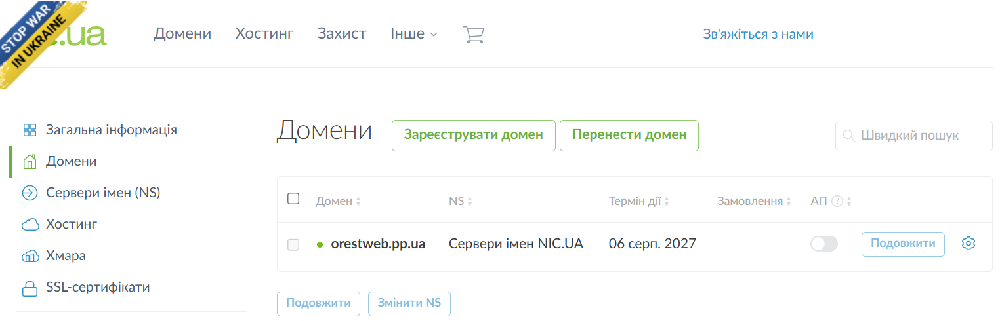
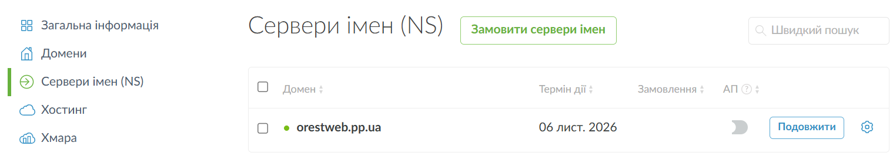
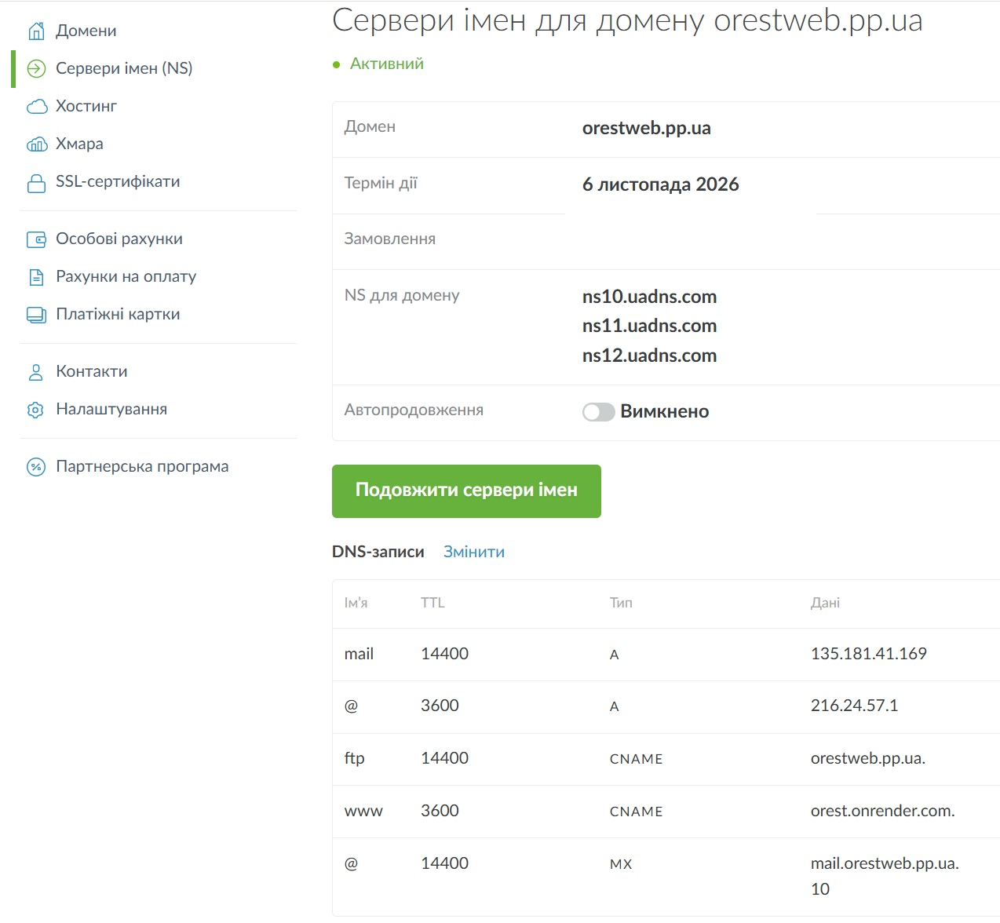
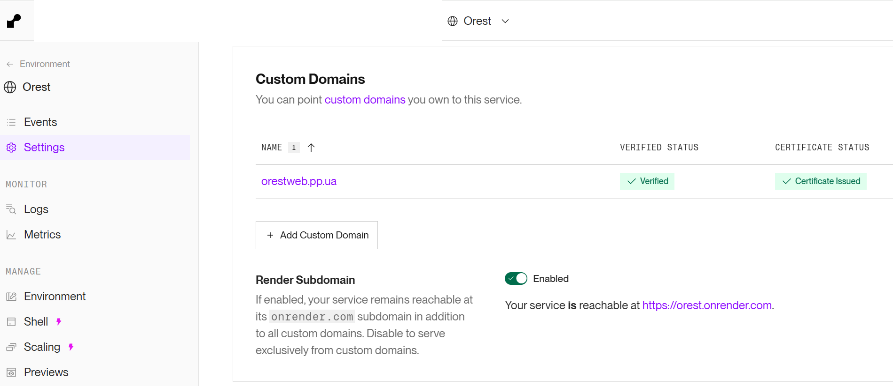
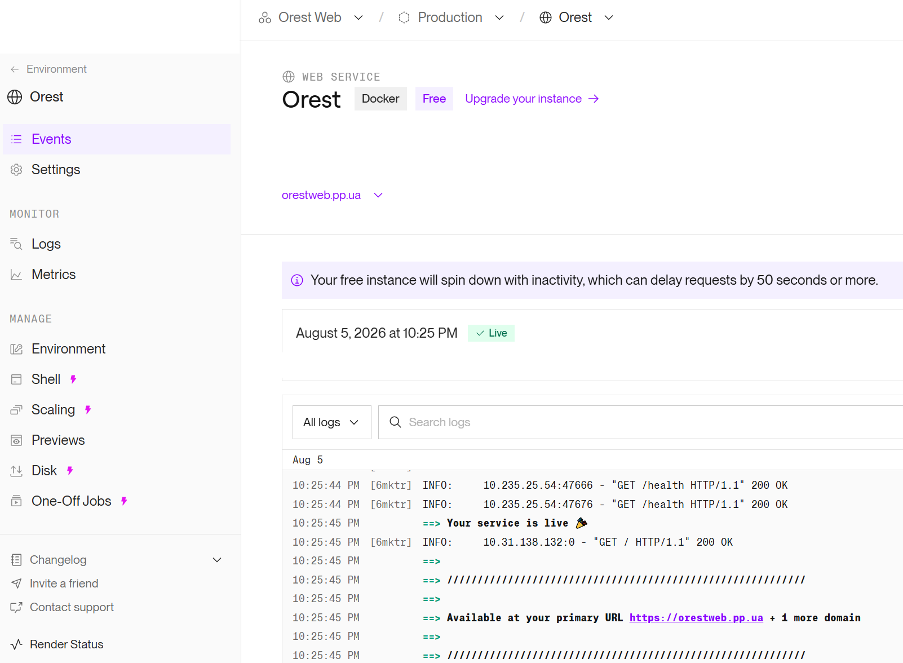
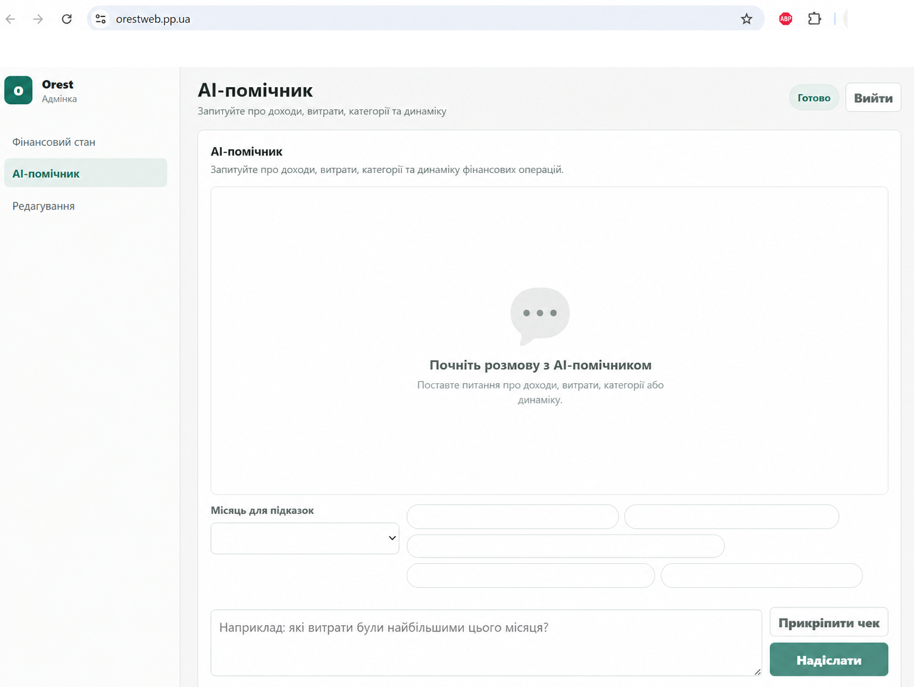

# Власний домен Orest

## Результат

- Технічний URL Render: <https://orest.onrender.com>
- Власний домен: <https://orestweb.pp.ua>
- Custom Domain у Render: `orestweb.pp.ua`.
- Домен у Render має статуси **Verified** і **Certificate Issued**, тому HTTPS
  для власного домену працює.

## NS і DNS

Для домену використано DNS-сервери NIC.UA:

```text
ns10.uadns.com
ns11.uadns.com
ns12.uadns.com
```

Для маршрутизації вебзастосунку додано такі записи:

| Ім'я | Тип | Значення | TTL |
| --- | --- | --- | ---: |
| `@` | `A` | `216.24.57.1` | `3600` |
| `www` | `CNAME` | `orest.onrender.com.` | `3600` |

Записи `mail`, `MX` та `ftp` належать до пошти або FTP. Вони не впливають на
доступність вебзастосунку й не змінювалися в межах підключення домену.

## Перевірка DNS і HTTPS

Налаштування звірено у кабінеті NIC.UA та за допомогою DNS-запитів:

```powershell
Resolve-DnsName -Name orestweb.pp.ua -Type A
Resolve-DnsName -Name www.orestweb.pp.ua -Type CNAME
```

Отриманий результат: `orestweb.pp.ua` вказує на `216.24.57.1`, а
`www.orestweb.pp.ua` — на `orest.onrender.com`. У Render домен підтверджено
(`Verified`) і для нього випущено сертифікат (`Certificate Issued`). Додатково
сайт відкрито через `https://orestweb.pp.ua`; він віддає React SPA. Для
перевірки застосунку й Neon використовується `https://orestweb.pp.ua/health`,
який повертає `200 {"status":"ok"}`.

## Виявлена й виправлена проблема

Початкове значення CNAME для `www` було інтерпретовано NIC.UA як відносне
ім'я: `orest.onrender.com.orestweb.pp.ua.`. Через це `www` не міг вказувати на
Render. Проблему виявлено під час перегляду DNS-записів у NIC.UA. Запис
виправлено на повне доменне ім'я `orest.onrender.com.` з крапкою наприкінці;
після поширення DNS це підтверджено командою `Resolve-DnsName` і статусом
**Verified** у Render.

## Обмеження Free Render

- Інстанс може засинати після 15 хвилин без трафіку; перший запит після цього
  може затримуватися приблизно на 50 секунд або довше.
- Файлова система тимчасова: локальні файли зникають після restart, redeploy
  або sleep; persistent disk для Free Web Service недоступний.
- План має ліміти instance hours, bandwidth і build minutes, тому це
  навчальне середовище, а не production із гарантованою доступністю.

## Перевірка секретів і персональних даних

Перед фіксацією результату виконано:

```powershell
powershell -ExecutionPolicy Bypass -File .\scripts\scan-secrets.ps1
git diff --check
```

`git diff --check` завершився без помилок. Сканер позначив один збіг у
`tests/test_google_drive.py` — тестове значення `client-secret`; це не
реальний ключ чи облікові дані. Первинні скриншоти, що могли містити
персональні або фінансові дані, виключено з Git через `.gitignore`; у цей
документ додано лише знеособлені копії.

## Підтверджувальні скриншоти

Скриншоти нижче містять лише знеособлені дані; первинні знімки екрана не
додаються до Git.

### Домен у NIC.UA



### NS-сервери та DNS-записи





### Custom Domain і статуси Render





### Застосунок за власним доменом


