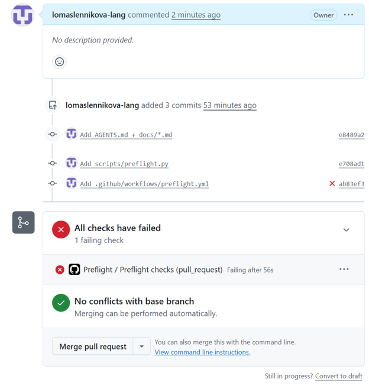
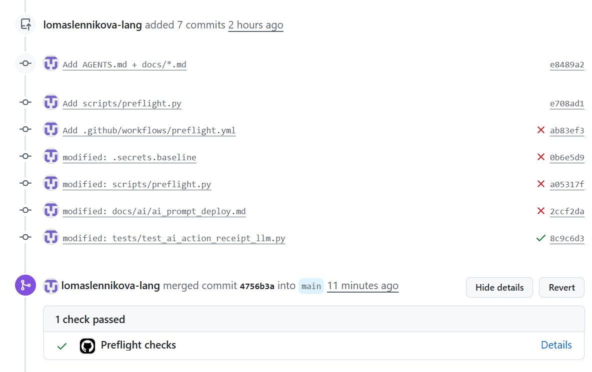

# Maintenance guide

Цей документ — короткий operational guide для перевірки змін, deploy і реакції
на інциденти. Детальна модель розгортання описана в
[`DEPLOYMENT.md`](DEPLOYMENT.md), а покрокові Render/DNS/OAuth дії — у
[`deploy.md`](deploy.md).

## AGENTS.md

[`AGENTS.md`](../AGENTS.md) — робочий контракт для AI-агентів. Він визначає:

- які джерела в репозиторії є актуальними;
- межі архітектури, безпеки та роботи з секретами;
- правила для міграцій, AI write-actions, Git і перевірок;
- критерії завершення задачі та формат звіту.

Починайте нетривіальну задачу з читання `AGENTS.md`; він не замінює технічні
документи, а вказує, коли й до яких із них звертатися.

## Local preflight

Перед commit або deploy запустіть із кореня репозиторію:

```powershell
.\.venv\Scripts\python.exe scripts\preflight.py
```

У середовищі з активним virtual environment достатньо:

```bash
python scripts/preflight.py
```

Preflight перевіряє:

- компіляцію Python-коду;
- React production build;
- Docker image через `Dockerfile.render`;
- відсутність непідтверджених секретів;
- критичні конфігураційні файли;
- що `.env` не відстежується Git.

Він завершується на першому проблемному етапі з ненульовим exit code. Виправте
саме цей етап і запустіть preflight повторно.

## GitHub Actions і Render

Workflow [`.github/workflows/preflight.yml`](../.github/workflows/preflight.yml)
запускається для Pull Request у `main` і після push у `main`. Він повторює
основні preflight-перевірки: Python compile, React build, Docker build, secret
scan і critical config check.

GitHub Actions не виконує deployment і не отримує production-секрети.

Render окремо від CI відстежує нові commit у налаштованій гілці сервісу
(поточна модель — `main`) і запускає власний build/deploy. Перед інцидентними
діями перевірте в Render Dashboard, що service прив'язаний до очікуваної гілки
та commit SHA.

### Приклад CI lifecycle

Перший check може впасти через конкретний preflight-етап. Відкрийте його logs,
виправте лише вказану проблему окремим commit і push у ту саму PR-гілку.



*Failed Pull Request check: merge не слід виконувати, доки preflight не стане
зеленим.*

Після успішного повторного запуску GitHub показує зелений **Preflight checks**;
лише тоді PR можна безпечно merge за умови, що інші required checks також
пройшли.



*Successful Preflight check після окремого commit із виправленням.*

## Production logs і smoke test

Production logs читайте у Render Dashboard: **Service → Logs**. Для конкретної
версії також перевіряйте **Service → Deploys** і її commit SHA. Не копіюйте в
тикети, документацію або чат секрети, cookie, `DATABASE_URL`, OAuth-токени чи
приватні фінансові дані.

Базовий post-deploy smoke test:

```text
GET /health              -> 200 {"status":"ok"}
GET /openapi.json        -> 200
GET /api/me без сесії    -> 401
GET /                    -> React SPA
```

`/health` також перевіряє доступність Neon через `SELECT 1`. Додайте лише
feature-specific smoke check для зміненої функції: наприклад login, AI chat,
receipt upload або Google Drive. Не запускайте деструктивні або платні зовнішні
сценарії лише заради повноти перевірки.

## Fix чи rollback

Зробіть **fix**, коли проблема локальна, причина зрозуміла, а застосунок
залишається безпечним і доступним: наприклад помилка відображення, validation
або помилка в ізольованому endpoint. Додайте вузький тест, проганяйте preflight
і доставляйте виправлення окремим commit.

Зробіть **rollback**, коли новий deploy спричинив outage, помилку
автентифікації/авторизації, ризик витоку чи некоректного запису даних, або
причина ще не зрозуміла. Спочатку зупиніть небезпечні дії, зафіксуйте deploy
SHA та relevant технічні логи, потім повертайте відомо робочу версію.

Не робіть rollback автоматично для виконаних міграцій, видалення даних або
зовнішніх side effects.

## Code rollback через Git

Для вже опублікованого commit створіть новий commit, який скасовує його:

```bash
git log --oneline
git revert <bad-commit-sha>
git push origin main
```

Для merge commit потрібен головний parent, зазвичай `1`:

```bash
git revert -m 1 <bad-merge-commit-sha>
git push origin main
```

За звичайного процесу створіть PR із revert commit, дочекайтеся зеленого CI та
merge. Не використовуйте force-push або переписування історії як incident
rollback.

## Повернення попереднього deploy у Render

1. Відкрийте **Render Dashboard → Service → Deploys**.
2. Виберіть останній відомо робочий successful deploy і звірте його SHA.
3. Використайте дію **Rollback**, якщо вона доступна в UI, та дочекайтеся
   статусу **Live**.
4. Виконайте базовий smoke test і перевірте Logs.
5. Створіть Git revert для проблемного commit, щоб наступний автоматичний
   deploy не повернув небажаний код.

Якщо кнопки rollback немає або UI змінився, безпечний шлях — Git revert і
новий deploy із `main`; не змінюйте гілку сервісу імпульсивно.

## Чому rollback коду не відновлює Neon DB

Код і Neon PostgreSQL — різні стани. Git/Render rollback повертає container
image, але не скасовує вже застосовані Alembic-міграції, записані транзакції,
AI action results, змінені дані чи зовнішні side effects.

Відновлення даних потребує окремого контрольованого плану: оцінки міграції,
backup/restore можливостей Neon, безпечної forward-міграції або цільового
виправлення даних. Не запускайте `alembic downgrade` проти production лише
тому, що код було відкотлено.
